+++
date = '2025-08-14T09:30:09-04:00'
draft = false
title = 'Reverse Engineering of the Lockbit Linux ESXi Variant'
+++

Welcome to the Hack & Cheese blog! We’re diving straight in with a recent reverse engineering adventure that I did for fun. I spotted a Linux malware sample a while back that is reasonably complex, and a nice challenge to analyze. I’m talking about Linux ransomware of the Lockbit family, that is geared towards attacks on ESXi servers.

Now hold on a second. Is this some hot, new malware, unseen before? No not at all. I chose this sample because its curious, but it has [already been discovered and blogged about by TrendMicro](https://www.trendmicro.com/en_us/research/22/a/analysis-and-Impact-of-lockbit-ransomwares-first-linux-and-vmware-esxi-variant.html) way back in 2022. Please note, my goal with this project is not to enhance threat detection, but to shine a light on how to reverse engineer a state-of-the-art piece of Linux malware. And, simply to indulge in the joy that is in-depth reverse engineering work.

What is the state of Linux malware and what makes this sample state-of-the-art? Linux in-the-wild malware is evolving, where a few years ago there was an overwhelming amount of DDoS bots and bitcoin miners, running in the shadows, there is now also ransomware, info stealers, downloaders, some of that written in Rust or in Go, some sophisticated pieces like eBPF based malware, and more. We can observe the landscape bloom, rather slowly if I might say, and very unlike what we know from Windows. Interestingly, the majority of Linux malware is designed to run on IoT devices; your home routers, security cameras, the fridge maybe? And there are only so many things that make sense to do on a home router, mostly that’s denial of service and bitcoin mining. In the shadows.

And then, Linux malware authors found out that most of this world’s servers are Linux based. Why mine bitcoin on a fridge if you could also do it on some beefy cloud instance that runs Wordpress with an admin password of ‘password123’. I’m not even kidding. But ransomware? For quite a while us analysts were wondering what's the point of Linux ransomware, I mean who would pay money to decrypt files on their home router. Or their cloud server? Most cloud data of value lives in storage, not on the compute instances. And then there came Linux ESXi ransomware, and we were like.. oh.

And ever since I learned about that I was curious how that stuff works. So here we go, lets take apart Lockbit for ESXi.

### A Note about Lockbit
News reports say that the Lockbit gang has been taken down by law enforcement, their infrastructure rooted out and their operation disabled. Good stuff, bye Felicia, but also nothing to do with this blog. Again, this is about reverse engineering, not about threat detection.

### Special Thanks
Before I start things off, a special Thank You to the honorary cryptography advisor of Hack & Cheese, Jean-Philippe Aumasson! His contribution is highly appreciated, and detailed in the _The Actual Crypto_ section of the post.

# Lockbit ESXi Ransomware For Linux

## Evasion Techniques

What initially caught my eye about this sample is its use of ptrace. Ptrace is a Linux system call that allows tracing of other processes, and in malware it is oftentimes used in anti-analysis techniques. Our sample at hand tries to use `PTRACE_ATTACH` to attach to its own parent process. Should this attempt fail the malware will exit with status 1 (the green branch in graphic). And, it just so turns out that if a process is being traced by a debugger, then the child can’t attach to the parent as it normally would, because it is already being traced. Nothing sophisticated, but certainly interesting.

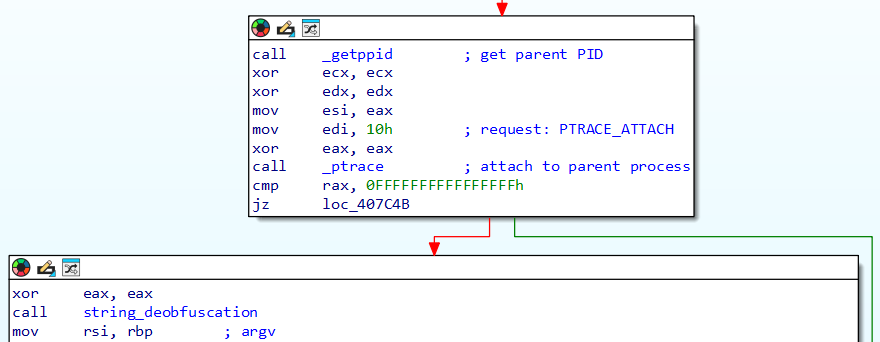  

So we have ourselves a simple yet effective dynamic analysis evasion, since the most prominent Linux tracing tools (think gdb, strace for instance) rely on ptrace. What do we do if we encounter this technique while debugging? Simple, we steer the debugger to the conditional jump instruction and flip the zero flag, debugger 101. Or go patching the jump to an unconditional jump in the binary itself, problem solved forever.

Promptly following the tracer evasion the malware continues to deobfuscate strings that are used throughout the binary. What I mean by obfuscated can be seen in the next graphic, that shows a string in the data section that I’ve named `help_menu`, which is completely unreadable at this point.

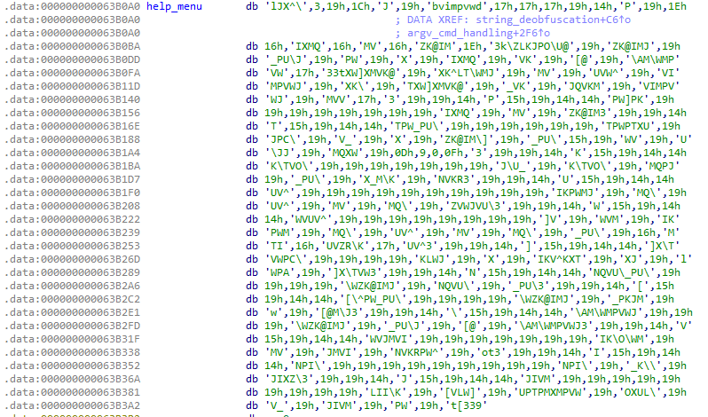  

If we check out where this string is being treated in the _string_deobfuscation_ function we find a little loop with a rolling xor deobfuscation routine. EAX here holds the hard coded value of 39h, or 57, and this value is used as a base value to xor the obfuscated strings with, byte by byte, until we hit a null byte. Super simple, and this would be easily scripted if we wanted to automate string deobfuscation. As it turns out, almost all strings in this binary are deobfuscated using the same routine and base value, and within the same function.

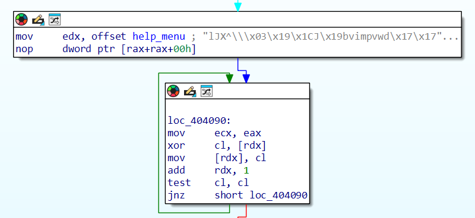

Since I am lazy however, and only script RE tooling once I absolutely have to, what I did is simply the following; I ran the debugger through all the string deobfuscation loops, let IDAPro auto-rename the global offsets of said strings, and made myself a dump file of the binary’s data section with readable strings and name. Doing so I ended up with an .idb with named string references, and a text file with readable strings where I could look up what a given string reference refers to.

Quick and dirty I would call that, but with only a few dozen string references I really saw no point in making this any more complicated. And winning, the readable strings we uncover there do half the analysis work for us! We get a help menu, the ransom note, a list of bash commands to navigate virtual machine installations, and, hold on to your seats, a wealth of log messages. Like, a lot of those. Tehehe... when I said reasonably complex malware, I did not mean they were super stealthy by any means.

## The Control Flow

One important item that aids analysis significantly is the help menu mentioned prior. I don’t know when malware started shipping with help menus, but it is certainly appreciated. This list of options explains a range of functionality implemented in the code. Also, most malware is relatively simple software. That means there usually is some central orchestration function from where most of the interesting sub graphs branch off. That can be main, or as it goes in this case, it is the argv parsing functions that evaluates command line arguments.

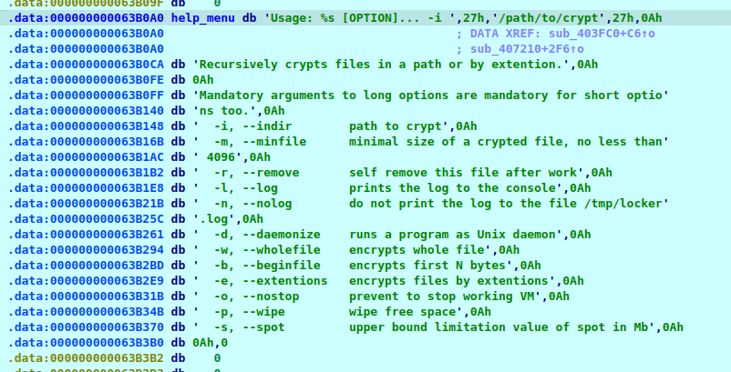  

From what we know so far a few questions arise. The prime ransomware question would be, when it says “crypts files”, what files are we encrypting and how, with what key(s)? I’ll talk extensively about that later. Another interesting bit are the log/nolog options, like what do you mean, help menu wasn’t enough we’re also writing a log. Juicy. And then it says daemonize and wipe, other features we’ll explore just because I'm curious.

A quick look at the structure of the argv parsing function shows this intriguing switch-case graph. In reality this is the function I started with when analyzing the sample. We see that its a switch-case graph because of all the basic blocks displayed in parallel (the cases), descending from one single block (the switch). We have ourselves a parser, and parsers are interesting since they make decisions based on input. The input here is the command line arguments, which control the configuration of the malware process, for instance the minimum size of a file to encrypt, the log mode, or the list of extensions the malware seeks to encrypt. See help menu, and trust me that the code matches :)

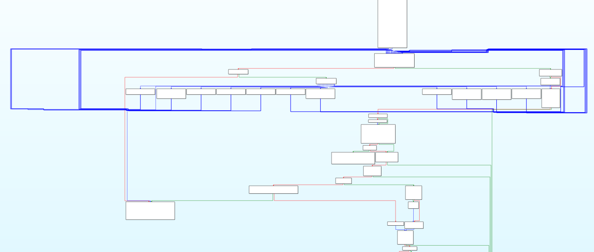  

## Logging Feature

This piece of malware shipped with superb logging capabilities, that make the code almost self explanatory, if we weren’t in this for the reverse engineering, but just the log reading. Logging can be either turned off, or its going to a log file named `/tmp/locklog`, or its going to the logfile and stdout as well. Log entries follow a specific format:

    [%s][%d][+] Start encrypting file %s

The log entries all follow the same format, starting with the current date and time and the current thread ID, and the log message might have 0 or more arguments, like the filename about to be encrypted in the example above.

## Daemonizing The Malware Process

Having a closer look at that option, it turns out implementation is really simple. LibC offers a function named daemon, and as any LibC function it has a man page, and anyway what it does is detach the calling process from its terminal and run it in the background as a system daemon. The rest is reading documentation. But what I spotted in this routine is code that writes a file named `/tmp/locker.pid`, which will hold the process’ PID. This file is used to indicate that there is a Lockbit process running on the system, to avoid running twice. Our malware creates an exclusive lock on this file and only lets go once its done with all the nefarious things its gotta do. Now if this were the only ransomware family out there, all we needed to do is have this file permanently sit in the tmp folder and be safe. Wouldn’t that be nice.

## Whats with the Wiping?

The help menu says “wipe free space”, but what does that mean and how is it done? Turns out the malware does the following. It executes `df -h` through the popen API, where the process output is piped back to the calling process and can be parsed as text. From that text the malware plucks out paths. Oddly, it seems the logic is to parse out a path from each line, starting at the first ‘/’ character, until we hit a line feed character.

Now hold on a second, I pasted example output for `df -h` below, if I apply that logic to each line, then I get nonsense for line 3, the root partition, since between the first slash and linefeed I have, well, the whole line. Weirdness, but wouldn’t be the first time malware code has flaws.

Anyway, for each line, everything between the first slash and linefeed (aka. new line) is handed to a thread which continues to do the wiping.

    [user@machine](mailto:user@machine):~$ df -h
    Filesystem Size Used Avail Use% Mounted on
    tmpfs 	   598M 1.5M 597M  1%   /run
    /dev/sda2  25G  13G  11G  54%   /
    tmpfs      3.0G 0    3.0G  0%   /dev/shm
    tmpfs      5.0M 8.0K 5.0M  1%   /run/lock
    tmpfs      598M 120K 598M  1%   /run/user/1000

Those threads is where it gets interesting. The thread handler creates a temp file under the mount point, grabs  [file system information](https://linux.die.net/man/3/fstatvfs) for where the temp file lives, and starts writing. The file system information tells the block size of the file system (f_bsize), and the number of free blocks (f_bfree). The handler allocates one block size full of zero’d memory and writes number of free blocks to the temp file. I did not know this is the way to erase free disk memory, now I know. Makes forensics harder I assume.

## Whats with the ESXi?

Now here is the aspect that readers probably are most interested in. We’re dealing with ESXi ransomware, and a bomb indicator for this is one of the first log lines the malware intends to print, which says `LockBit Linux/ESXi locker V: 1.0`. So far so good, but how does that work?

In the bigger picture, encrypting virtual machines is the big goal of this malware. The ransomware can be launched on an arbitrary folder, but attacking virtual machines is the core feature, and the default path of execution, with or without command line arguments. The code lists virtual machines, stops them if desired, and goes on to encrypt the folders where the VMs live. And drops ransom notes of course.

It turns out that the interactions the malware has with virtual machines are navigated through bash commands, unraveled by the aforementioned string deobfuscation, and executed through popen or calls to the system libc function. As simple as that. Tools that the malware uses include vm-support, vmdumper, vmware and vim-cmd, also awk, grep, and xargs, standard Linux tools. In fact, before encrypting anything there is a check whether vm-support, vmdumper and vim-cmd are available on the system, and if they’re not we print the help menu and exit. I’m still not over the fact that there is a help menu.

### SSH Much

If the tools are available however the next thing the malware does is run `vim-cmd hostsvc/enable_ssh`, and this command does exactly what it sounds like, its the official method to enable ssh on ESXi servers. What I couldn’t find in the binary is the installation of a rougue ssh key to truly enable a backdoor or any other nefarious configuration of the freshly enabled ssh. Come on guys.

### Suspending VMs

If command line arguments indicate to do so the malware will suspend running virtual machines before launching encryption. To find running VMs the malware runs `vmdumper -l` and parses the output, gathering WIDs of running machines, their world IDs. The command to then suspend a running machine goes as follows:

    esxcli vm process kill --type=force --world-id=$wid

And, for each WID the malware tries nine times to suspend it. This is interesting since it seems the malware is trying to avoid encrypting running machines. If the `nostop` option listed in the help menu is set then running virtual machines are not suspended, and also not encrypted. The default behavior is to suspend running machines, and subsequently encrypt all machines.

## File Encryption

Now how does it encrypt virtual machines? The malware lists machines with the command `vm-support –listvms`, extracts the folder path for each machine, and runs a method I suitably named *encrypt_folder*. One can configure a VM exclusion list, and btw. there is also the option to define a file extension exclusion list. For each folder then the malware lists the file content using the glob function from libc, and if the file doesn’t match any exclusion filter the malware starts a thread to then launch encryption. Ransomware basics. Cool.

What about file encryption, how does that work? Well, that was a hard nut to crack. Something I haven’t mentioned yet, our binary is dynamically linked against libc, but also statically built with libsodium and some other code that's neither libsodium nor the malware per se. The binary is stripped, meaning no function names for application code and statically compiled library code are available, however the dyamically linked portions do have names. Have to, otherwise loading wouldn’t work. So far so good. That leaves us with unidentified cryptographic code to analyze. Juicy.

This was not a straight forward analysis job. But I’ll outline here how I found some answers.

### Library Code Identification

We know that libsodium exists in this binary because of strings. Hold on, I said strings here are obfuscated, no? Well yes, the application code strings, the ones belonging to the malware. The libsodium code was used as is. So we do see strings like `LibsodiumDRGsodium/core.c` and `sodium/utils.c`, how I established that's gotta be libsodium is left as an exercise to the reader ;)

As a higher level note, one does not want to go reverse engineering cryptographic code if one does not absolutely have to. Its much more convenient to identify said code in a library, put a function name on it, and be done with it. And to take another step back, my crypto spidey senses generally tingle when I see functions with lots of arithmetic operations and little branches or memory writes. I mean, look at this next graphic, would you want to try and figure out what's happening here?

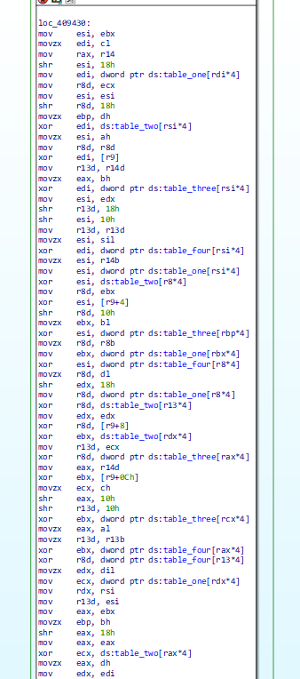  

Cool, so at this point we know there is crypto code, and we know libsodium code is in the binary. By working my way through the file encryption routine I was able to identify three functions that needed naming, that I did not want to reverse engineer. The next thing that comes to mind is automated library code detection. We have a library name, and we’ve got FLIRT. FLIRT stands for Fast Library Identification and Recognition Technology, and it is IDAPro’s way of naming library code. The other RE frameworks we love so much, BinaryNinja, Ghidra, radare2, etc., all have their own way to facilitate library code detection. But then.. go grab libsodium, build it, create signatures (super easy with FLIRT), load those signatures on that malware binary and – nothing. Out of hundreds of library functions we get three named. With an older version of libsodium we recover fourteen names. Neither of those helps with the identification of the three I mentioned that I needed.

Bummer, what now? That's where we need to start working smarter, not harder. At this point I had the compiled libsodium in another disassembler instance looking at the functions. Can’t we spot the three mystery functions in the libsodium binary, even if automated recognition is failing? It helps to understand [how FLIRT works](https://docs.hex-rays.com/user-guide/signatures/flirt/ida-f.l.i.r.t.-technology-in-depth), or generally how library code identification is done in modern frameworks. I won’t go into details here, the problem boils down to those identification signatures being too specific for the job. So then whats left is to do the recognition manually.

#### Manual Library Code Identification

How to do that without actually reverse engineering what a library function does goes as follows. We got the function, its input parameters, its size, and cross references from the function, to globals and other functions. Thinking of references, string references are great, since we can read them, but also since they’re most likely exist in every version of the library. So if we find a library string in our malware binary thats referenced in the unidentified function or any of its subroutines, then we can look for that same string in the library binary and through cross references on that string dig our way to the routine or subroutine we’re trying to identify.

As it goes, even just putting a name on a subroutine of a function we’re trying to identify goes a long way, since then we can dig our way through cross references of that subroutine, looking for our original candidate.

Thats exactly how I identified the first mystery function, so long story short, what we do here is brain powered graph similarity matching. The two graphics below compare the sole reference of the string “sysrandom” in the malware binary, to the sole reference of the same string in libsodium.so.

Libsodium vs. malware:

  
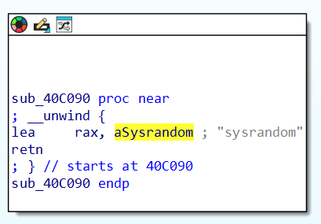  

That string is the name of a function, which if we walk back through cross references we find in the GOT table, no clue why at this point but it doesn’t matter since what we’re after is to identify the list of functions that reference this GOT entry and name them in the malware, as according to the names in libsodium. If there is only one cross reference walking up the subgraph is easy, if we have a list of candidates figuring out the right path requires more finesse.

Libsodium vs. malware:

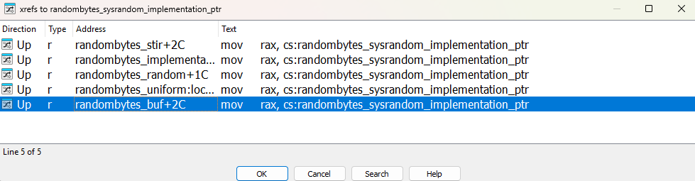 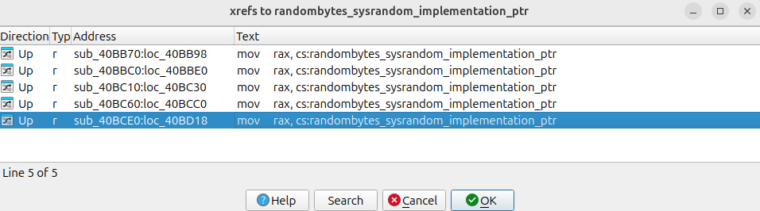  

With a short list of five candidates its a simple task of visual comparison of function graphs to assign names in the malware. In fact I found the one I was looking for (note: one level below the mystery function in the malware’s encryption routine) rather quickly and it turned out to be libsodium's `randombytes_stir`. See the two functions in comparison below, libsodium vs. malware. Very minor differences, but enough to thwart automated library code detection, and interestingly I’m quite sure that these differences stem from the compiler, not actual source code differences.

Libsodium vs. malware:

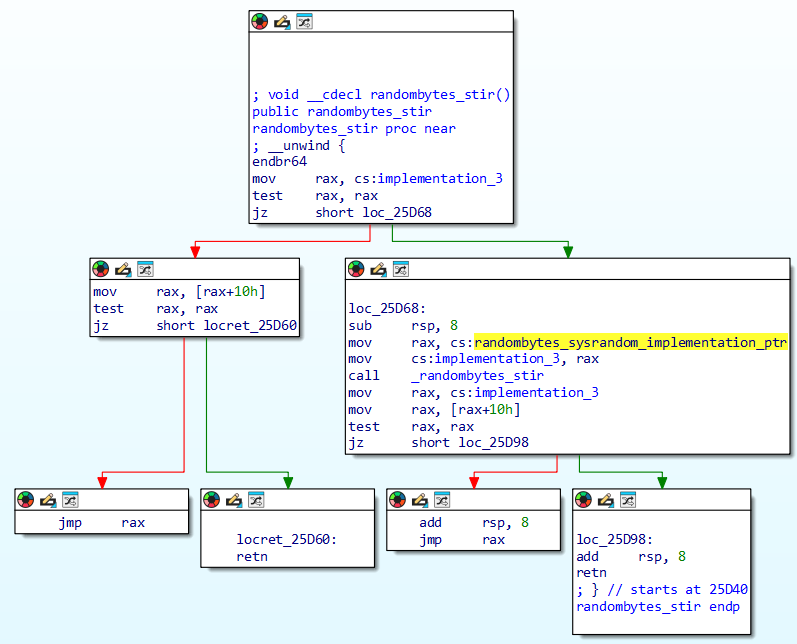  

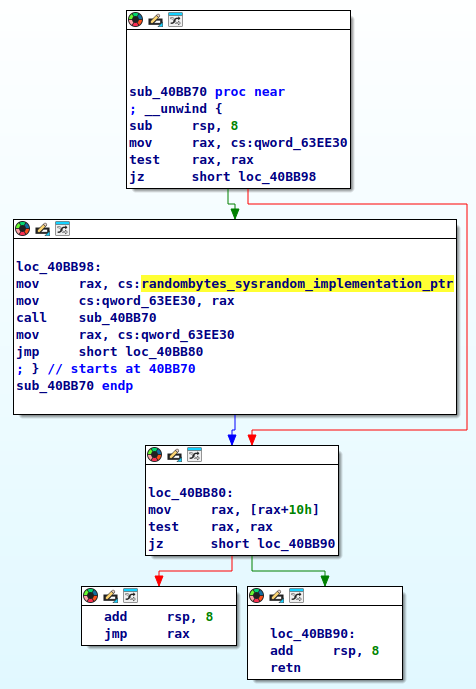  
  
From `randombytes_stir` there is one more level up to the mystery function called in the malware, and with the same comparison method we find the mystery function – `randombytes_buf`. The comparison method includes looking at the function’s control flow, but also at cross references to globals and other functions. In fact those references turn out crucial, a good strategy is to name as many things as possible; globals, functions, other references. It is much more likely a compiler changes the instruction makeup or control flow of a function than it is to remove or reorder references. So, with sufficient cross references in a function we get a high level fingerprint of a function. Then, by trial-and-error naming of whatever we can deterministically name we inch closer and closer to the naming goal of higher level functions. In the case of `randombytes_buf` this was fairly simple, where the method really comes into play is with the second mystery function.

Mystery function number two (out of three) does not have any string references, or sub functions with string references. However, what we do see in the depths of the subgraph is references we named in the search of `randombytes_buf`, both globals and functions. With those names we get the mentioned high level fingerprints, even if just partial, that then allow naming more and more of the subgraph, eventually leading to a fingerprint that allows identifying mystery function number two. We find `crypto_box_seal`.

Now, while this sounds relatively straight forward, keep a few things in mind. We had to have libsodium.so to establish names, and it is a lot of work digging through subgraphs. One problem I haven’t mentioned yet is function inlining. While looking for `crypto_box_seal` I came across inlined functions, which change function size, instruction layout, control flow, and cross reference patterns. Thats when we start looking for patterns within patterns, and you can imagine how that quickly becomes very confusing. In the case of `crypto_box_seal` it was possible to figure it out, but in reality there might be cases where one hits a limit.

Which gets me to mystery function number three (of three), which I couldn’t find in libsodium for the life of me, as it turns out, because its not in there.

### The Actual Crypto

Before we talk about number three, lets see what we got so far. The malware’s file encryption routine calls first `randombytes_buf` to generate 32 bytes of random data. Thats 128 bits for reference. It then hands that buffer of random data to `crypto_box_seal`, which is where I needed to learn what a crypto box is, but anyway, we get a box holding 32 bytes of random data, thats encrypted using a hard coded public key. We learned what is what from the function signature of `crypto_box_seal`. The function has documentation if you’re inclined to learn more.

In short, what is happening that the malware creates a unique 128 bit encryption key for every file, and attaches that unique encryption key to the encrypted file in a public-key encrypted box. Nifty, and apparently quite common in modern day ransomware. This technique allows the use of symmetric encryption while not leaving key material sitting in memory for forensic analysts to grab and defeat the whole ransomware attack. Sure, they can go and dump process memory during encryption, but all they’ll get is the current unique key for one file, and one file only.

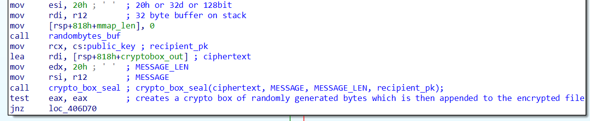

So far so good, we know where the encryption key comes from, how big it is, we have the third mystery function which we know must be the actual encryption, cause guess what its arguments include the encryption key and two pointers to the file to-be-encrypted. And, we see in that function that we read from one pointer, magic happens, and then we write to the other pointer. Same file.

But what is this function, what's the algorithm, I now need to know. The algorithm is really just two functions, no other function references, but with references to globals, to five tables. One table of 256 bytes, and four tables of 1024 bytes. The 256-byte table it turns out can be found on the internet as [the Rijndael s-box](https://en.wikipedia.org/wiki/Rijndael_S-box) that AES is using. Cool, AES also typically uses 128-bit keys. But, at this point I still didn’t know for sure this is AES.

That is where I got stuck, the algorithm looked nothing like libsodium’s AES implementation, or the AES code I could find on the interwebs. Mostly I was confused what's with those four rather large tables. Enter Jean-Philippe Aumasson, or JP, who I ran into at Blackhat recently. Upon explaining my issue it took him only a few minutes to dig up this version of AES: [https://github.com/pjok1122/AES-Optimization/blob/master/aes.c](https://github.com/pjok1122/AES-Optimization/blob/master/aes.c). Turns out the four tables of 1024 bytes are really four tables with 256 4-byte integers, and specifically the tables in _this_ aes.c are almost identical to the ones in my malware. Boom. This is an optimized version of AES that uses lookup tables, so called T-tables. Thanks a million JP, that’s why I crown you with the honorary title of cryptographic advisor at Hack & Cheese!

After file encryption we drop a ransom note in each folder, its called `!!!-Restore-My-Files-!!!`, and its really long for being called a note, I didn’t actually read the whole thing. They do pride themselves for being the fastest ransomware, unclear whether they perf tested against other families but one wonders. Something disturbing, the note offers disgruntled corporate employees “millions of dollars” for launching the malware on their corporate computer. It says if you reach out on Tox messenger your privacy is guaranteed, now doesn’t that sound enticing. But anyways.

## The Summary

No, not my summary, the malware’s summary. Yes they print a summary to their log after file encryption is through. This, also, explains a lot about the inner malware function, and again I scratch my head over what these people thought stealth means.

Enjoy:

    ~~~~~~~~~~~~~~~~~~~~~~~~~~~~~~~~~~~~~~~~~
    %s%s
    ~~~~~~~~~~~~~~~~~~~~~~~~~~~~~~~~~~~~~~~~~
    Total files..................%llu
    Total VMs....................%llu
    ~~~~~~~~~~~~~~~~~~~~~~~~~~~~~~~~~~~~~~~~~
    Encrypted files..............%llu
    Encrypted VMs................%llu
    ~~~~~~~~~~~~~~~~~~~~~~~~~~~~~~~~~~~~~~~~~
    Total encrypted size.........%llu Mb
    Time spent for encryption....%llu sec
    $$$$$$$$$$$$$$$$$$$$$$$$$$$$$$$$$$$$$$$$$  

# Last Words

I think its a wrap, that is the Linux ESXi version of Lockbit ransomware. For no other reason than the joy of reverse engineering. Finally, I did really spend some time here. I found the dynamic analysis evasion trick interesting, and then there is something else about this binary that had me somewhat confused. In handling runtime data we see heavy stack usage, more so than what I’m used to. This makes an interesting challenge in figuring out data types and tracking the use of values through the program. This no doubt is some compiler’s handwriting, and who doesn’t love compilers!

I’ll leave you with the hash of the binary, and say adios, keep your eyes peeled for more reverse engineering content on here!

    SHA256: f3a1576837ed56bcf79ff486aadf36e78d624853e9409ec1823a6f46fd0143ea
